# 📊 Data Visualization Project Using ggplot2

This repository contains a complete R-based workflow demonstrating how to produce high-quality data visualizations using **ggplot2**, including bar plots, histograms, boxplots, scatterplots, and forest plots.

All code has been modularized into R scripts for clarity and reproducibility.

---

## 📁 Folder Structure

```
data-visualization-project/
│
├── README.md              # Project documentation
├── .gitignore             # Git ignored files
├── script.R               # Full combined analysis script
│
├── /data                  # Raw input datasets
│   ├── example_dataset.txt
│   └── results_catecholamine_chd.xlsx
│
├── /R                     # Modular R scripts
│   ├── 01_load_packages.R
│   ├── 02_load_data.R
│   ├── 03_barplots.R
│   ├── 04_histograms.R
│   ├── 05_boxplots.R
│   ├── 06_scatterplots.R
│   ├── 07_forestplot.R
│   └── 08_combined_scripts.R
│
├── /figures               # Exported plots
│   ├── barplot_smoking.png
│   ├── barplot_smoking_v2.png
│   ├── forest_plot.png
│   └── (placeholder)
│
└── /output                # Generated reports or tables
```

---

## 📦 Required Packages

- `ggplot2`
- `dplyr`
- `tidyr`
- `scales`
- `readxl`

The repository includes a script (`01_load_packages.R`) that automatically installs any missing packages.

---

## 📚 Datasets

### **1. example_dataset.txt**  
Contains health variables such as:

- Smoking status  
- Blood pressure  
- Height  
- Weight  
- Sex  

### **2. results_catecholamine_chd.xlsx**  
Contains Odds Ratios and confidence intervals for building a forest plot.

---

## 🖼️ Visualizations Included

### ✔ Barplots  

- Frequency of smoking categories
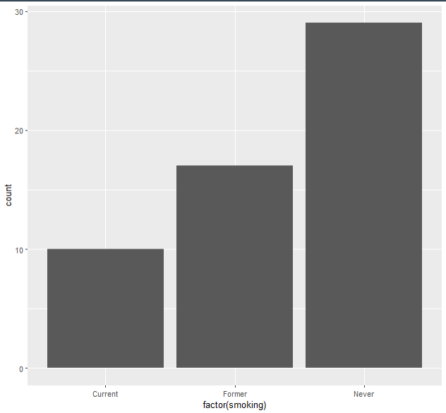

- Frequency of smoking categories (ordered)


- Frequency of smoking categories (ordered)
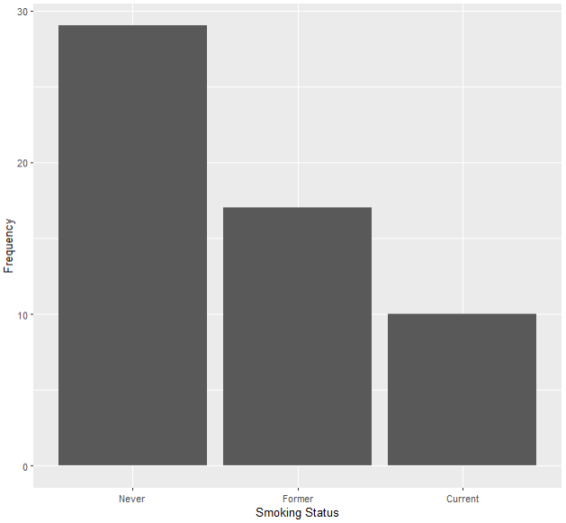

- Percentage-scaled bars 
- Frequency of smoking categories (ordered)
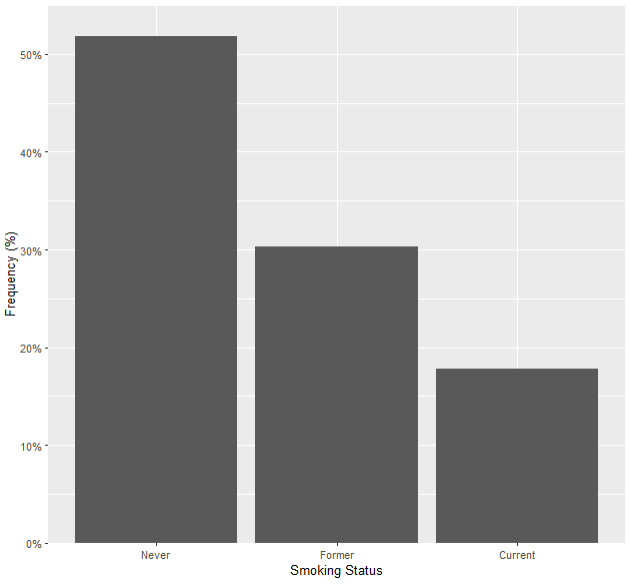

- Custom colors and themes  
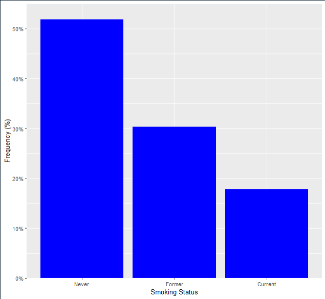

- Custom colors and themes r base (no ggplot)
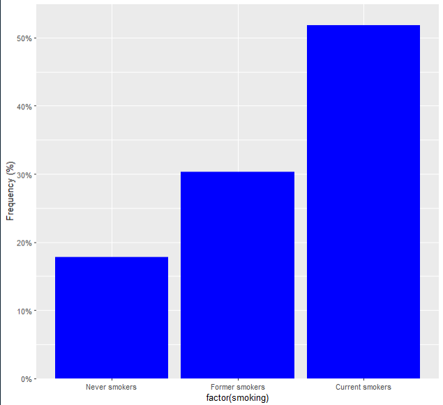


### ✔ Histograms  
- Distribution of systolic blood pressure  
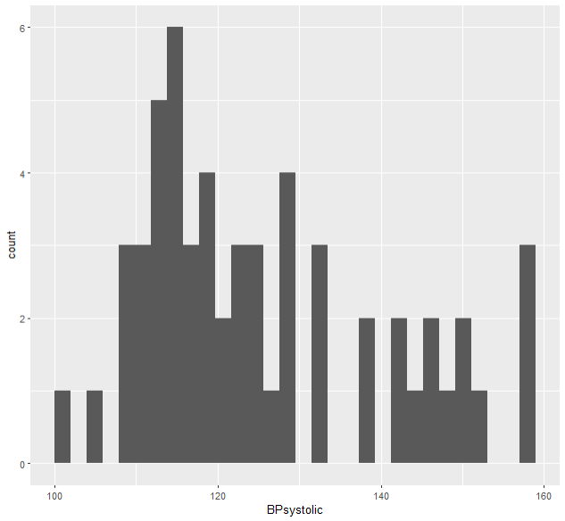


- Custom bins, themes, axis labels  
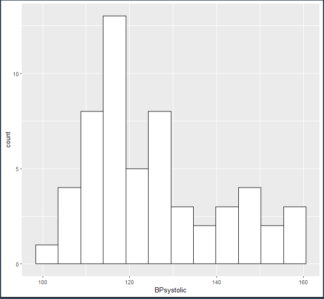

- Custom bins, themes, axis labels and theme  
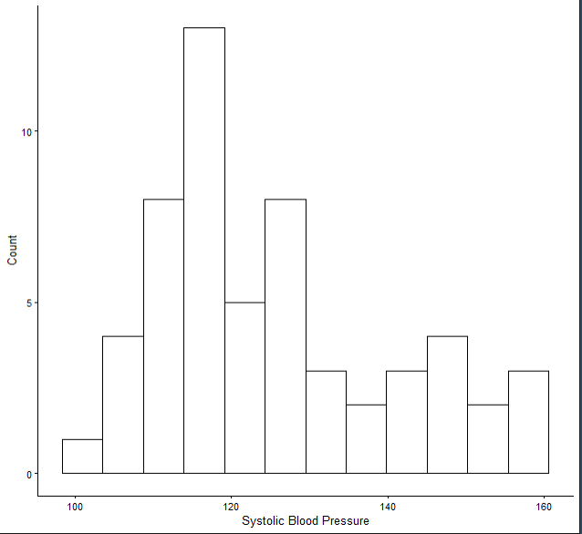

### ✔ Boxplots  

- Height distribution by sex  


### ✔ Scatterplots  
- Height vs weight, colored by sex  


- Height vs weight, colored by sex  


### ✔ Forest Plot 

- Log-scale odds ratios with CIs 
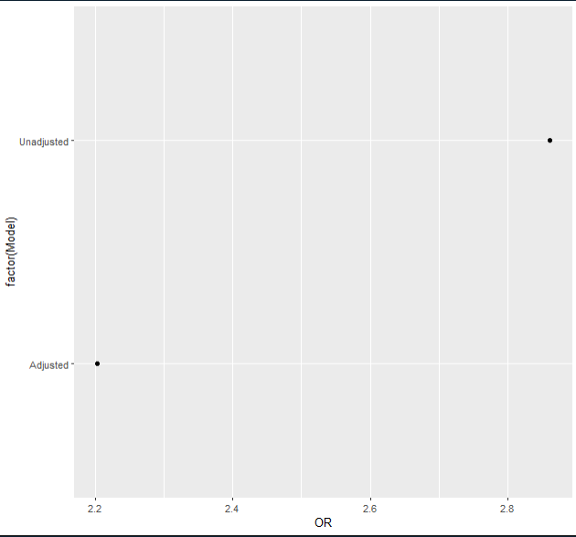

- Vertical reference line (OR = 1) 
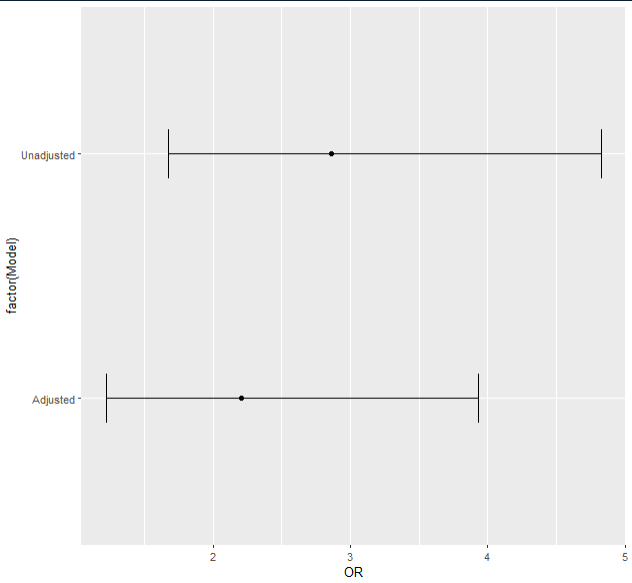

- Vertical reference line (OR = 1) 
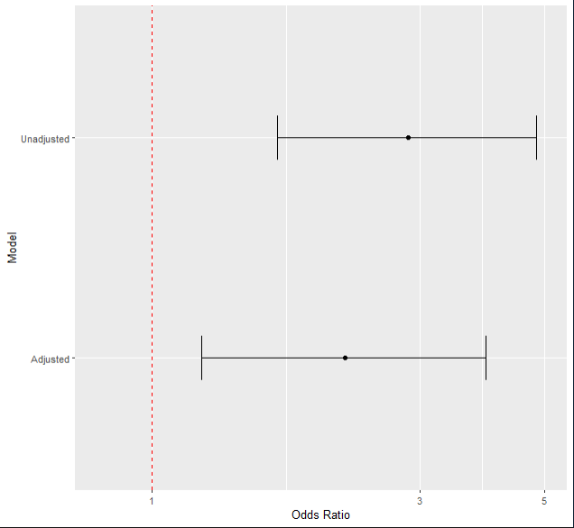

- Clean theme + annotations  
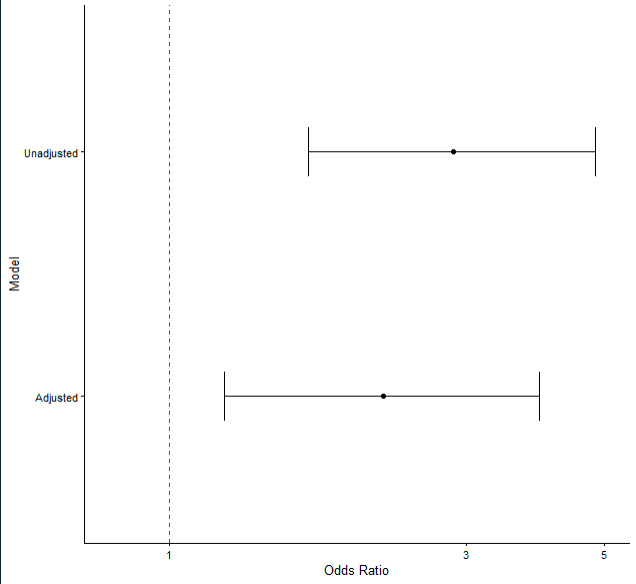

All generated figures are saved in `/figures`.

---

## ▶ Running the Project

Run the entire workflow:

```r
source("script.R")
```

Or run modular scripts:

```r
source("R/01_load_packages.R")
source("R/02_load_data.R")
source("R/03_barplots.R")
...
```

---

## 📤 Output

Generated figures are automatically saved as PNG files in:

```
/figures
```

---

## 📌 Notes

- Image files are included as placeholders; replace them with your generated ones.
- The project is fully reproducible as long as datasets are placed in the `/data` folder.

---

## 🧑‍💻 Authors

Prime Study Group (Unversity of Oulu)
Benjamin Onyekachi Divine
Austin Ibilbor Ewere
Faith Kolawole
Edeko Eromosele

Data Science & Epidemiology Projects  

---

## 📜 License

MIT License (optional — I can generate a LICENSE file too)

